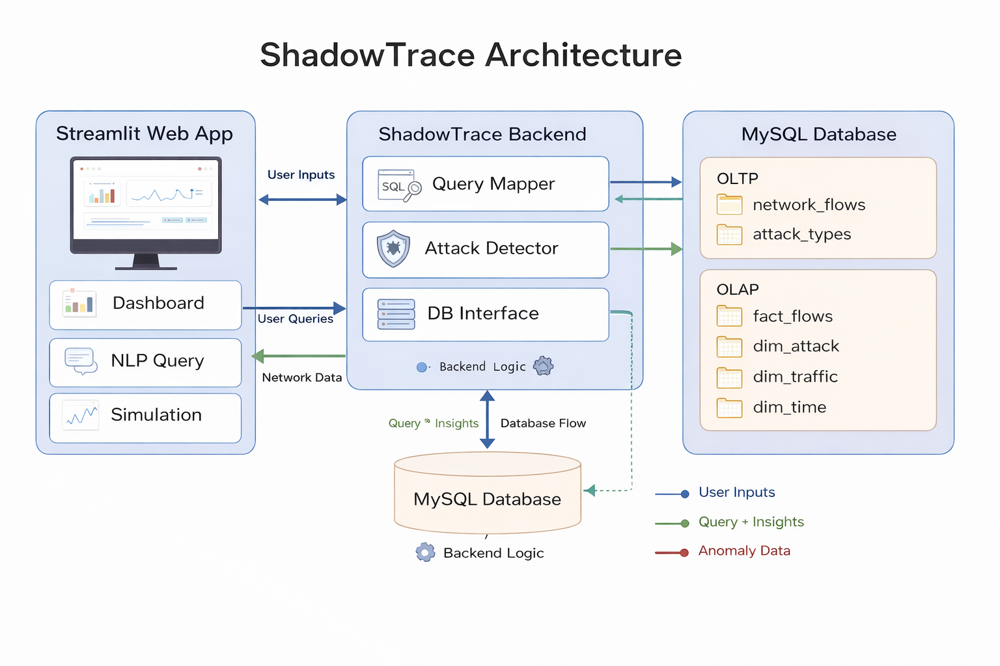
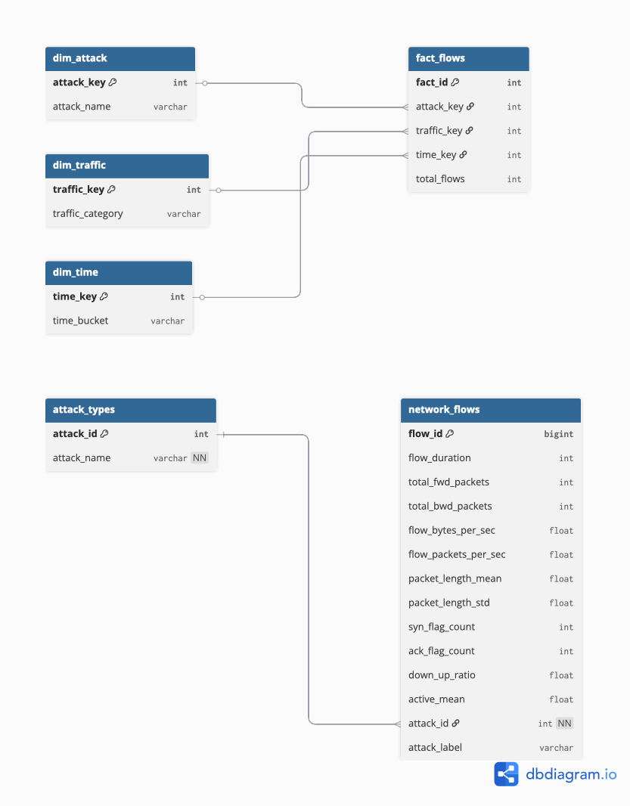
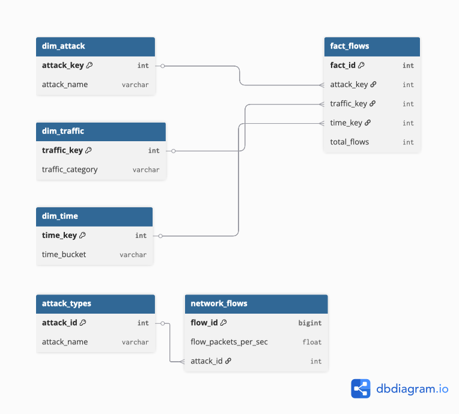
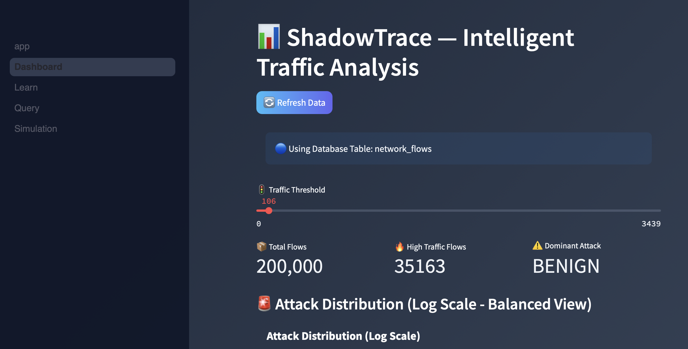
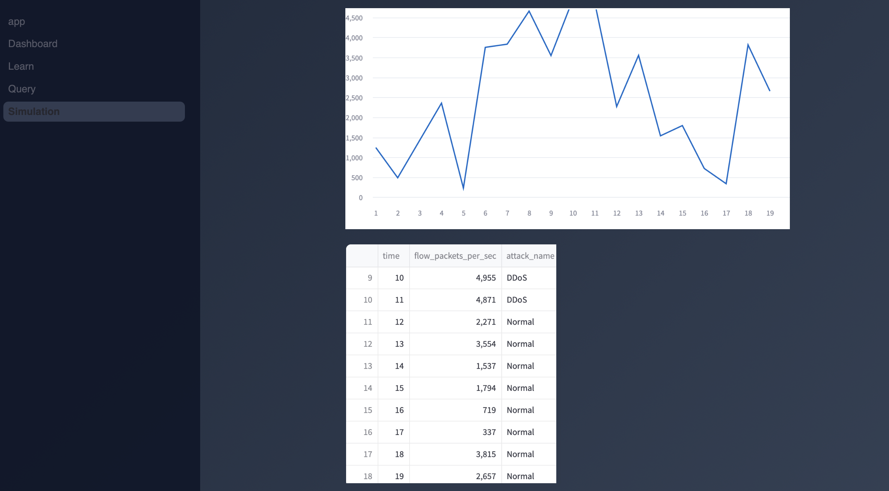
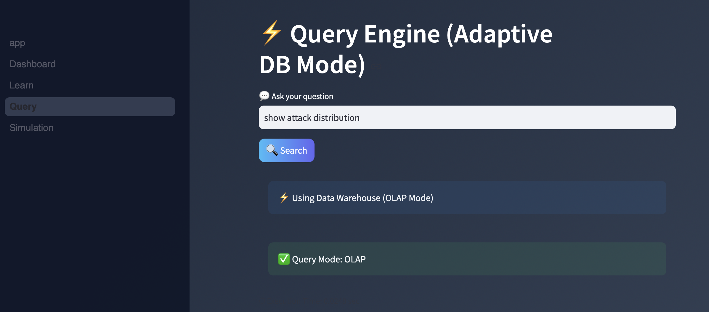

# ⚡ ShadowTrace: Network Traffic Analysis & Attack Detection

ShadowTrace is a hybrid **OLTP + OLAP intelligent network traffic analysis system** that combines real-time simulation, adaptive query processing, and natural language querying to detect and analyze cyber attack patterns.

---

## 📌 Key Highlights

* 📊 Real-time traffic simulation with anomaly detection
* 🧠 Natural Language → SQL query system with smart OLAP or OLTP intelligence
* 🗄️ MySQL database with optimized schema & indexing
* ⚡ OLTP + OLAP (Star Schema) integration
* 📈 Interactive dashboard for traffic insights

---

## 📦 Requirements

Install dependencies:

```bash
pip install -r requirements.txt
```

---

## 🏗️ System Architecture



---

## 🧩 ER Diagram



---

## 📐 Relational Schema



---

## 📸 Screenshots

### 📊 Dashboard

#### Overview



#### Attack Distribution


#### Data Summary


---

### ⚡ Simulation

#### Traffic Graph



#### Data Table


---

### 💬 NLP Query



---

### 📖 Learn Module


---

## ✨ Unique Capabilities

* ⚡ Adaptive Query Engine (Automatically switches between OLTP and OLAP)
* 🧠 Explainable Query System (Shows why a query uses OLAP vs OLTP)
* ⚖️ Imbalanced Data Handling (Log-scale visualization for minority attacks)
* 🔄 Multi-source Data Engine (Database + Simulation + Uploaded CSV)

---

## 🚀 Features

### 📊 Dashboard

* Visualizes network traffic patterns
* Shows high-intensity flows
* Displays dominant attack types

### ⚡ Live Simulation

* Generates real-time traffic data
* Upload CSV files for custom traffic analysis
* Detects high packet rate anomalies 
* Adjustable simulation speed

### 💬 NLP Query System

* Converts natural language into SQL queries
* Example:

  * "Show most common attacks"
  * "Find high traffic flows"

### 📖 Learning Module

* Explains attack types
* Shows risk levels and prevention methods

## ⚖️ Handling Imbalanced Data

The dataset is highly skewed toward BENIGN traffic.  
To ensure visibility of minority attack classes, logarithmic scaling is used in visualizations.

This enables meaningful analysis of rare but critical attack patterns.

---

## ⚡ Adaptive Query Engine

The system intelligently determines whether a query should be executed on:

* **OLTP (Transactional DB)** → for raw data queries  
* **OLAP (Data Warehouse)** → for analytical queries  

### Example:

| User Query | Mode |
|----------|------|
| "Show all flows" | OLTP |
| "Attack distribution" | OLAP |

This improves performance and mimics real-world data systems.

---
## 🧠 Database Design

### 🔹 OLTP (Transactional)

* `network_flows`
* `attack_types`

### 🔹 OLAP (Star Schema)

* `fact_flows`
* `dim_attack`
* `dim_traffic`
* `dim_time`

---

## ⚡ Core DBMS Implementation

* Hybrid OLTP + OLAP Architecture
* Star Schema Design for Analytical Queries
* Query Routing based on Intent Detection
* Indexed Query Optimization (Single + Composite)
* Materialized Views for Aggregation
* Stored Procedures for Reusable Logic
* Execution Plan Analysis (EXPLAIN)

---

## 🛠️ Tech Stack

* **Frontend:** Streamlit
* **Backend:** Python
* **Database:** MySQL
* **Libraries:** Pandas, NumPy

---

## 📂 Dataset

Due to GitHub size limits, the full dataset is not included in this repository.

🔗 Download Dataset:
https://drive.google.com/drive/folders/1ghUgOM6Sz9Y5HP9vi60ip2JfVF-NolU1?usp=share_link

After downloading, place the files inside:
`dataset/`

Dataset Source: CICIDS2017 (real-world intrusion detection dataset)

---

## 📂 Project Structure

```
shadow_trace/
├── requirements.txt
├── app/
│   ├── app.py
│   ├── db.py
│   ├── load_flows.py
│   ├── query_mapper.py
│   ├── ui.py
│   └── pages/
│
├── dataset/
├── database/
├── docs/
├── screenshots/
├── README.md
```

---

## ⚙️ Setup Instructions

### 1️⃣ Clone repository

```bash
git clone https://github.com/kypuranik/shadow_trace
cd shadow_trace
```

### 2️⃣ Setup database

```sql
CREATE DATABASE shadow_trace;
```

Run SQL files from the `database/` folder.

### 3️⃣ Install dependencies

```bash
pip install streamlit pandas numpy pymysql
```

### 4️⃣ Run application

```bash
cd app
streamlit run app.py
```

---

## 🎯 Use Cases

* Network traffic monitoring
* Cyber attack detection (DDoS, PortScan)
* DBMS concept demonstration
* Educational cybersecurity tool

---

## 🔥 Project Highlights

* Designed a hybrid OLTP + OLAP database system
* Implemented real-time traffic simulation with anomaly detection
* Built NLP-based query interface converting natural language to SQL
* Optimized queries using indexes and execution plan analysis

---

## 📈 Key Contributions

* Built a hybrid database system combining OLTP and OLAP
* Implemented adaptive query routing based on user intent
* Designed a real-time traffic simulation engine
* Enabled natural language querying over structured data

---

## 📌 Future Improvements

* Real-time packet capture integration
* Machine learning-based attack detection
* Advanced visualization dashboards

---

## 👨‍💻 Author

Kaivalya Puranik

---

## ⭐ If you like this project

Give it a ⭐ on GitHub!
